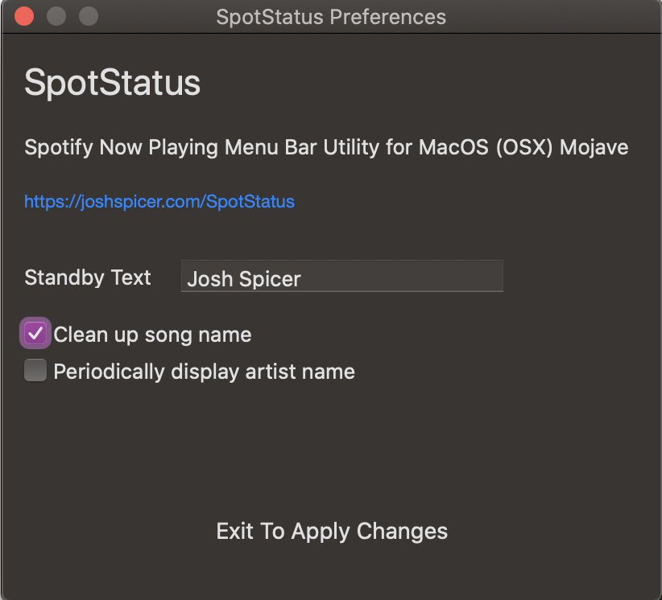
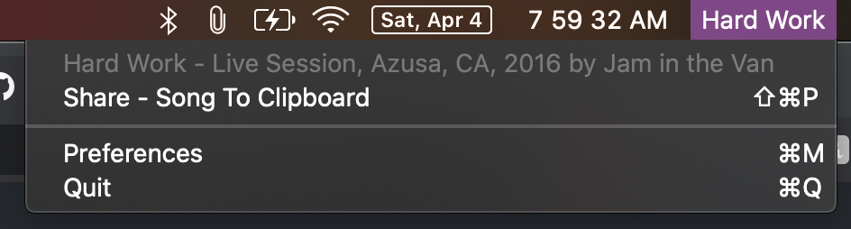

# SpotStatus
Spotify Now Playing Menu Bar Utility for OSX Mojave, Catalina, and Big Sur

~SpotStatus was last built and tested on MacOS 10.15.4~

SpotStatus has been tested on MacOS 11.0.1.

# Usage
You can build the following Xcode project from the source code provided. Note that with Mac OS Catalina you may need to [notarize](https://developer.apple.com/documentation/xcode/notarizing_macos_software_before_distribution) your build before using.

For convenience, i've provided a .zip of the MacOS binary. You can [download release 1.3.1 here](https://github.com/joshspicer/SpotStatus/releases). 

### Download Steps
1. Unzip
2. Copy to `/Applications`
3. If necessary, mark as executable (necessary depending on unarchiver used).  
`chmod +x /Applications/SpotStatus.app/Contents/MacOS/SpotStatus` **NOTE**: This will solve seeing  _"The Application "SpotStatus" can't be opened"_

SpotStatus will open in the menu bar. Click on the icon to configure!

### Hash

If you get SpotStatus.app from elsewhere, confirm the hash as what is listed on the [relevant release](https://github.com/joshspicer/SpotStatus/releases). 

`$ shasum -a 256 /Applications/SpotStatus.app/Contents/MacOS/SpotStatus`

## Tips

On MacOS you can drag around menu items by holding down COMMAND and dragging elements left and right.  You can use this to reposition SpotStatus with other items on your menu bar. 

## Intro
There are a lot of good Spotify + menu bar projects that already exist, but many are outdated and few have been updated for OSX Mojave (and its [awesome gatekeeper "features”](https://joshspicer.com/applescript-mojave)).  SpotStatus was build from the ground up specifically for Mojave. 

Easily see at a glance what song is playing. Click in to see more details (including artist information).

I find myself sharing a lot of music via spotify uris.  In the menu bar you can add that uri to your clipboard for easy sending.

Written in Swift 4.  Utilizes AppleScript to speak with Spotify, thus permission to do so is necessary on first launch.  App _Should_ support from 10.12+. Permission granting is only necessary on 10.14+ (Mojave).  

## Preferences

SpotStatus can be configured via its preferences panel.

### "Clean up song name"

Optionally hide the "extras" from a song title. (thanks, [skypanther](https://github.com/skypanther)!)

## Collaborators

Collaboration/PRs are encouraged!  Thanks to [skypanther](https://github.com/skypanther) for his help so far.  
